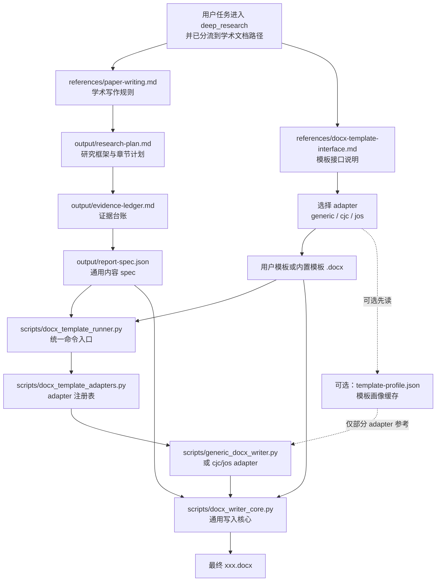
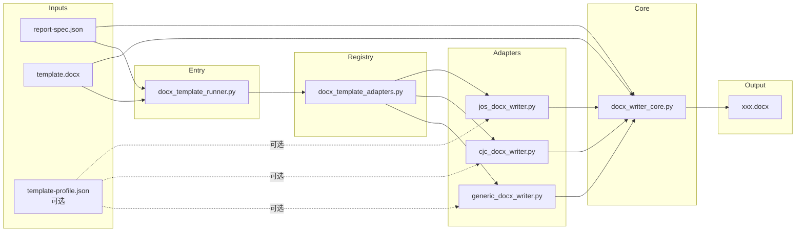
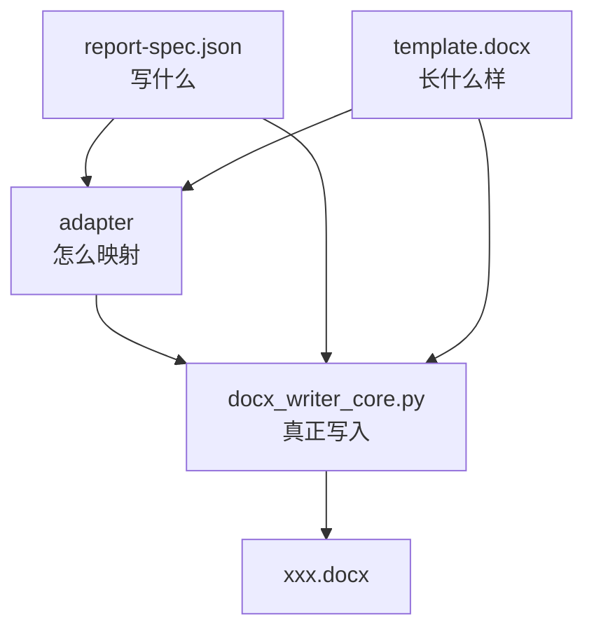

# 论文 DOCX 生成流程图

本文件只解释“学术文档路径”里论文生成 `.docx` 的调用关系，不解释普通报告路径。

## 一、整体流程

## 二、调用关系

## 三、每个文件做什么

- `output/research-plan.md`：研究范围、章节计划、执行顺序。
- `output/evidence-ledger.md`：关键判断与来源台账，正文内容应先在这里被证据约束。
- `output/report-spec.json`：通用内容协议，描述标题、作者、摘要、章节、参考文献等“写什么”。
- `references/paper-writing.md`：学术写作规则，决定怎么组织论文内容。
- `references/docx-template-interface.md`：说明有哪些 adapter、统一入口是什么。
- `scripts/docx_template_runner.py`：外部统一调用入口，接收 `inspect` / `generate`。
- `scripts/docx_template_adapters.py`：adapter 注册表，负责把 `generic`、`cjc`、`jos` 挂进统一接口。
- `scripts/generic_docx_writer.py`：通用模板适配器，适合用户上传自定义模板时做 best-effort 适配。
- `scripts/cjc_docx_writer.py`：`cjc` 专用适配器。
- `scripts/jos_docx_writer.py`：`jos` 专用适配器。
- `scripts/docx_writer_core.py`：真正的通用写入核心，负责清空正文、写 front matter、正文、参考文献、附录，并保留模板版式。
- `template.docx`：真实 Word 模板，决定样式、分栏、页眉页脚、版式。
- `template-profile.json`：可选模板画像，帮助 adapter 预先理解模板结构；不是所有 adapter 都必须依赖它。
- `xxx.docx`：最终正式稿，文件名按任务语义命名。

## 四、最短理解

